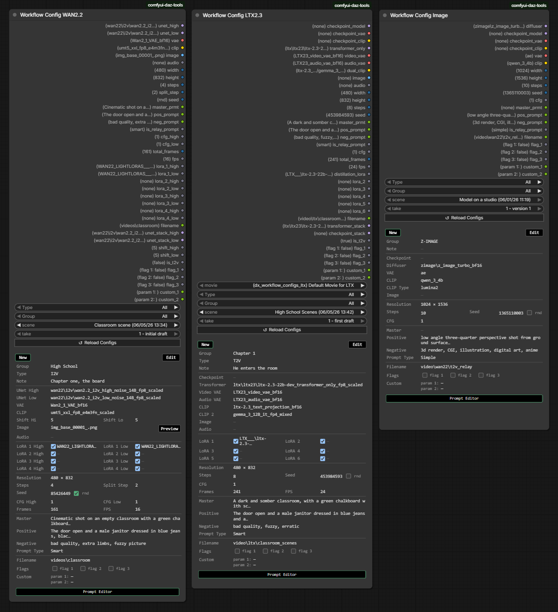
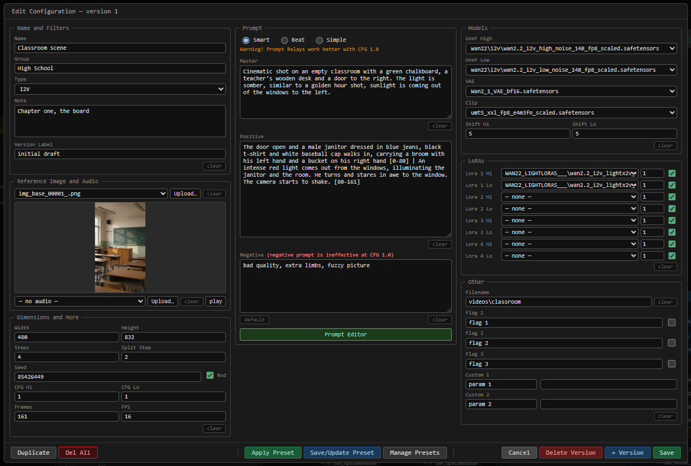
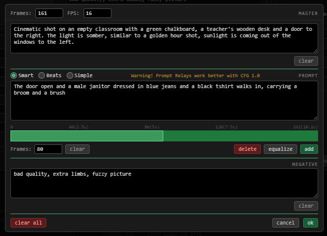

# comfyui-daz-tools

[](https://github.com/denyazzolin/comfyui-daz-tools/releases/latest)

ComfyUI custom nodes by [deny azzolin](https://github.com/denyazzolin).

## Installation

Install from Github...

```bash
cd ComfyUI/custom_nodes
git clone https://github.com/denyazzolin/comfyui-daz-tools
```

...and restart ComfyUI.

You can also install using the ComfyUI Manager. Look for **comfyui-daz-tools**

---

## Nodes

### Check Null (`utils`)
- **Input:** any value (optional)
- **Output:** `is_null` (BOOLEAN) — `True` if the value is null, None, NaN, or empty string

---

### Null Audio Checker (`audio`)
Checks if the audio output from [ComfyUI-VideoHelperSuite](https://github.com/Kosinkadink/ComfyUI-VideoHelperSuite) is null (video had no audio track).
- **Input:** `audio` (AUDIO)
- **Output:** `is_empty` (BOOLEAN)

---

### Abs Int (`math`)
- **Input:** `value` (INT)
- **Output:** `abs_value` (INT)

---

### Lora Inspector (`utils`)
Scans `models/loras`, reads safetensors metadata, and caches results to `models/loras/dx_lora_db.json`.

- **Inputs:** `lora` (dropdown, prefixed by category) · `rescan` (BOOLEAN)
- **Output:** `lora_data` (STRING) — JSON with three sections:
  - `general`: `filename`, `path`, `category`, `base_model_version`, `network_dim`, `network_alpha`, `potential_triggerwords`, `file_size_mb`, `last_modified`
  - `extended`: `network_module`, `network_args`, `steps`, `num_epochs`, `epoch`, `resolution`, `num_train_images`, `training_comment`
  - `training`: `optimizer`, `learning_rate`, `unet_lr`, `text_encoder_lr`, `lr_scheduler`, `noise_offset`, `min_snr_gamma`, `mixed_precision`

**Categories** (inferred from `ss_base_model_version`):

| Category | Matches |
|---|---|
| `WAN2.2` | Wan 2.2 |
| `WAN2.1` | Wan 2.1 |
| `LTX2.3` | LTX v2.3 |
| `LTX2` | LTX v2.x |
| `LTX` | LTX (any other) |
| `Flux1` | Flux.1 |
| `Flux2` | Flux 2 |
| `Flux2 Klein` | Flux Klein |
| `Chroma` | Chroma |
| `ZIT` | Z-Image |
| `Qwen` | Qwen |
| `Others` | Anything else or missing metadata |

**First-time setup:** entries show as `Unknown` until you tick **Rescan = Yes**, run the node once, then reload the page.

---

### Workflow Config WAN2.2 (`utils`) · Workflow Config LTX2.3 (`utils`) · Workflow Config Image (`utils`)

These nodes let you store named workflow presets — models, prompts, dimensions, LoRAs, and sampling parameters — and switch between them using a dropdown. When you select a preset, the node loads all the models and sends every value downstream automatically. There is no need to rewire anything when switching between setups.



#### Config files

Presets are stored in `dx_*.json` files inside `ComfyUI/user/default/workflows/.dx_mgr/`. The default file (`dx_workflow_configs.json`) is created automatically the first time you add a preset through the node UI.

You can have as many config files as you like — any `dx_*.json` file in that folder is picked up automatically, and a **Config file** dropdown appears when more than one file exists. Each file can hold presets for any node class (WAN2.2, LTX2.3, etc.), and each node shows only its own class entries. Use multiple files to organise presets by project, client, style, or any other grouping.

> **Custom location:** To store config files somewhere else, create `dx_root_dir_config.json` in the plugin folder (`custom_nodes/comfyui-daz-tools/`) with the key `"workflows_root_dir"` pointing to your preferred path. An annotated example is included as `dx_root_dir_config.example.jsonc`.

#### Filters

Two filters at the top of the node let you narrow down which presets are shown:

- **Type** — filter by workflow type: `All`, `I2V` (image-to-video), `T2V` (text-to-video), or `MULTI`.
- **Group** — filter by a custom group name you assign to presets, or `All` to show everything.

Filters check across all versions of a preset, so a preset that has both an I2V and a T2V version appears under both type filters. The version dropdown also updates to show only matching versions.

#### What each node stores

Both nodes share a common set of configurable fields:

| Field | What it controls |
|---|---|
| **Name / Group / Type** | How the preset is identified and filtered |
| **Label** | Optional short label shown in the version dropdown (e.g. `2 - cinematic`) |
| **Note** | Free-form note (up to 900 characters), shown on the node while in use |
| **Image** | Reference input image — a filename inside ComfyUI's input folder, or an absolute path |
| **Audio** | Reference input audio — a filename inside ComfyUI's input folder, or an absolute path. When set, the node outputs the decoded audio on the `audio` output for use downstream |
| **Width / Height** | Output frame dimensions |
| **Steps** | Number of denoising steps |
| **Seed** | Sampler seed. Enable **Randomize** to pick a new seed automatically on every run |
| **Total frames / FPS** | Video length and playback speed |
| **Master prompt** | Base text combined with the positive prompt (see Prompts below) |
| **Positive / Negative prompts** | Conditioning text sent to the sampler |
| **LoRA slots** | Up to 8 LoRA slots, each with a model name, strength, and enabled toggle. Disabled or empty slots are skipped automatically |
| **Filename** | Output path, relative to ComfyUI's output folder |
| **Flags 1 / 2 / 3** | Three boolean toggles with configurable labels — useful for routing or switching behaviour downstream |

**WAN2.2** additionally stores:

| Field | What it controls |
|---|---|
| **UNet High** | Diffusion model used for the high-quality pass |
| **UNet Low** | Diffusion model used for the low/draft pass |
| **VAE** | Video VAE |
| **CLIP** | Text encoder |
| **Split step** | The step at which the sampler switches from the high to the low model |
| **CFG High / CFG Low** | CFG scale for each model pass |
| **Shift High / Shift Low** | Timestep shift applied to the high and low model passes respectively (default 5.0). Equivalent to ComfyUI's **ModelSamplingSD3** node |

LoRA slots in WAN2.2 are arranged as 4 High/Low pairs, so each LoRA can be applied independently to each model pass. The node outputs a ready-to-use model stack for each pass (`unet_stack_high` and `unet_stack_low`) with all enabled LoRAs applied and the timestep shift already patched in — connect those directly to your sampler. **Shift is applied automatically inside these stacked outputs; it is a WAN2.2-only feature and is not present on the LTX2.3 node.**

**LTX2.3** additionally stores:

| Field | What it controls |
|---|---|
| **Checkpoint** | A combined model file that includes the diffusion model, CLIP, and VAE in one |
| **UNet / Transformer** | Standalone diffusion model, used when not loading from a checkpoint |
| **Video VAE / Audio VAE** | Separate VAE models for video and audio |
| **CLIP / CLIP 2** | Primary and secondary text encoders |
| **CFG** | CFG scale |

You can fill in either the checkpoint path or the standalone model paths — both sets of outputs are available on the node. The node outputs a ready-to-use model stack with all enabled LoRAs already applied for both the standalone transformer and the checkpoint model.

**Workflow Config Image** is designed for still-image pipelines. It has no LoRA slots, no audio field, and no video parameters (frames / FPS). The Type filter is also not shown — all presets are listed regardless of type.

| Field | What it controls |
|---|---|
| **Checkpoint** | A combined model file that includes the diffusion model, CLIP, and VAE in one |
| **Diffuser** | Standalone diffusion model, used when not loading from a checkpoint |
| **VAE** | Standalone VAE |
| **CLIP** | Standalone text encoder |
| **CLIP Type** | The encoder family used when loading the standalone CLIP — one of `stable_diffusion`, `flux`, `sd3`, `wan`, `hidream`, `chroma`, and many others |
| **CFG** | CFG scale |
| **Custom param 1 / 2** | Two free-form string outputs (`custom_1`, `custom_2`), each with a configurable label. Useful for passing arbitrary values downstream (e.g. style names, scheduler identifiers, preprocessor flags) |

You can fill in either the checkpoint path or the standalone model paths — all outputs are available on the node regardless of which set is populated.

#### Versioned presets



Each named preset can hold multiple **versions** — independent snapshots of all settings, numbered from 1. Switch between them with the **Version** dropdown without affecting other versions. The active version is saved in the workflow file and restored the next time you open it. If a version is missing at load time, the node falls back to the last available version.

Each version can have an optional short **label** shown in the dropdown (e.g. `2 - cinematic`). When you create a new version with **+ Version** and the label hasn't been changed, `alt ` is prepended automatically to distinguish it.

#### Managing prompts

Each version stores three prompt fields — **Master**, **Positive**, and **Negative** — along with a **Prompt Type** that controls how the positive prompt is structured.

| Type | How it works |
|---|---|
| **Smart** | The positive prompt is split into pipe-separated segments, each covering a frame range (`text [start-end] \| text [start-end] \| …`). A downstream Prompt Relay node handles distribution across frames. Best used with CFG ≈ 1.0. |
| **Beats** | Segments are aligned to time ranges in seconds (`[start-ends] text`, one per line). Frame counts are derived from FPS automatically. |
| **Simple** | A single flat text string passed as-is. |

For **Simple** and **Beats** types, the Master prompt is prepended to the positive prompt before it reaches the sampler. For **Smart**, the positive text goes to the relay as-is, and the Master is available as a separate output.

**Prompt Editor**



Click **Prompt Editor** inside the edit panel to open a full-screen editor. It loads the current Master, Positive, Negative, total frames, and FPS values and lets you work with them visually.

- **Frames / FPS** — changing Frames rescales all segment lengths proportionally; changing FPS updates the time labels on the ruler.
- **Master** — free-form text area.
- **Prompt type** — switch between Smart, Beats, and Simple. Switching converts existing segments where possible (e.g. Beats → Simple merges all segment texts into one block).
- **Segment bar** — a horizontal bar showing each segment as a proportional colour-coded block. Click any block to select it; the active segment is highlighted in green.
- **Frame ruler** — marks 0%, 25%, 50%, 75%, and 100% of total frames. When FPS is set, labels include both frame number and seconds (e.g. `40 (2.5s)`).
- **Segment text** — edit the text for the selected segment.
- **Segment controls** — set the exact frame count, clear the text, delete the segment, equalize all segments evenly, or add a new segment.
- **Negative** — free-form text area.
- **Clear All** — resets Master, Positive, and Negative to empty and collapses to a single segment.

Clicking **OK** sends all values back to the edit panel. It does **not** save to disk — use **Save** or **+ Version** in the edit panel to persist.

#### Edit mode

Open the full-screen edit panel by clicking the node's **Edit** button (or double-clicking the node on the canvas).

The panel has three columns:
- **Left:** Name, Group, Type, Note, reference image and audio, dimensions, seed, CFG, frames, and FPS.
- **Center:** Prompt Type selector, Master / Positive / Negative prompts, and the **Prompt Editor** button.
- **Right:** Model selectors, LoRA slots (name, strength, enabled toggle), filename, and flag labels.

| Button | What it does |
|---|---|
| **Save** | Overwrites the current version with the panel values |
| **+ Version** | Saves the current panel as a new auto-numbered version |
| **Duplicate** | Copies this preset — you can duplicate all versions, just the current version, or add a new version to the same preset. If there are unsaved changes, prompts to save or discard first |
| **Delete Version** | Removes the current version (removes the entire preset if it is the last version) |
| **Del All** | Deletes the entire preset and all its versions |
| **Cancel** | Returns to use mode; prompts to discard if there are unsaved changes |

**Name conflicts** — if saving or duplicating would clash with an existing preset name, a popup offers to cancel or auto-rename (appends `_alt` + 4 random digits).

**Rename warning** — saving with a changed name applies to all versions in the preset; a confirmation popup appears before proceeding.

**Use mode** — when not in edit mode, the node shows a summary of the active version. LoRA enabled toggles and flag toggles can be changed directly from use mode without opening the edit panel, and save immediately.

When no presets exist yet, the node shows an empty state with a centred **Create** button.

#### Preset library

The preset library is a shared collection of model-and-parameter templates (`dx_workflow_presets.json` inside `.dx_mgr/`). Presets are not tied to any single workflow — they capture a node's key settings (models, dimensions, CFG, type, etc.) and can be applied to any config of the same class. This makes spinning up a new scene significantly faster: instead of filling in every field from scratch, you pick a preset and the edit panel is pre-filled in one click.

Three buttons in the edit panel footer give access to the library:

**Apply Preset** — opens a browser showing all saved presets for this node class (WAN2.2 and LTX2.3 include a type filter). Select a preset and click **Apply** to write its values into the current edit panel. When you create a new config and presets already exist for that class, this browser opens automatically.

**Save / Update Preset** — opens the same browser with three actions:
- **Update the Version** — overwrites the selected preset version with the current config's values.
- **Save as new Version** — saves the current config as an additional numbered version under the same preset name.
- **Save as New Preset** — opens a form to name the new preset, choose its type (WAN2.2 and LTX2.3 only), add an optional version label and note. All model and parameter values are captured from the current config automatically. Saving is blocked if a preset with the same name already exists at version 1 for this class.

**Manage Presets** — opens the browser in delete mode. You can remove a single version or the entire preset and all its versions.
