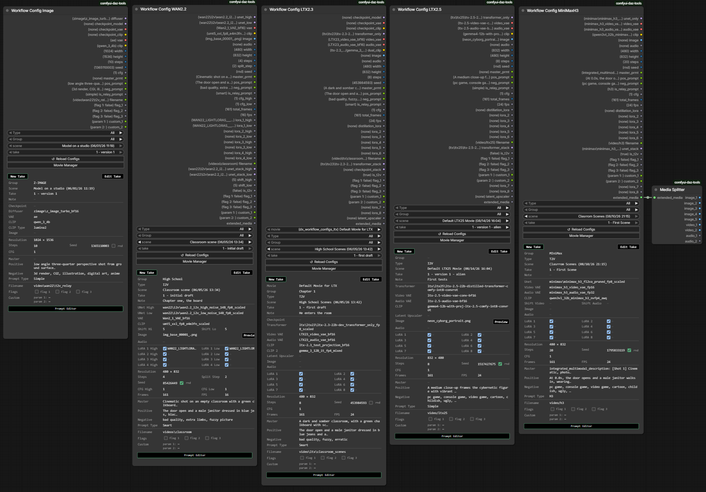
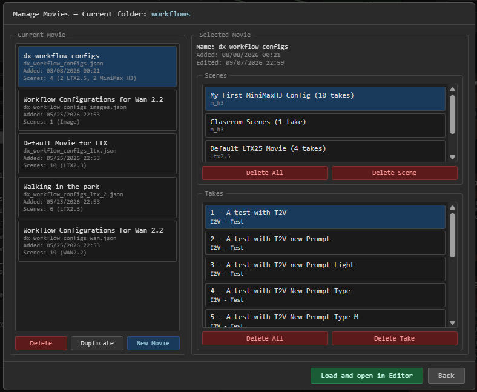
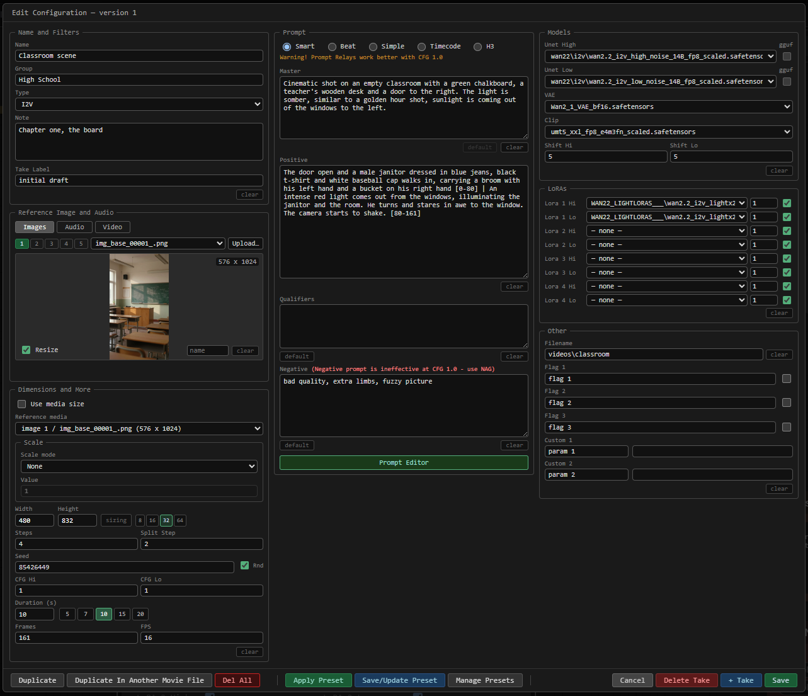
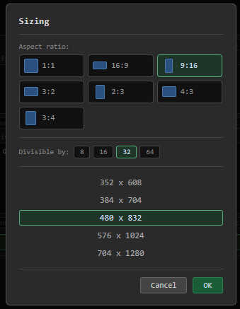
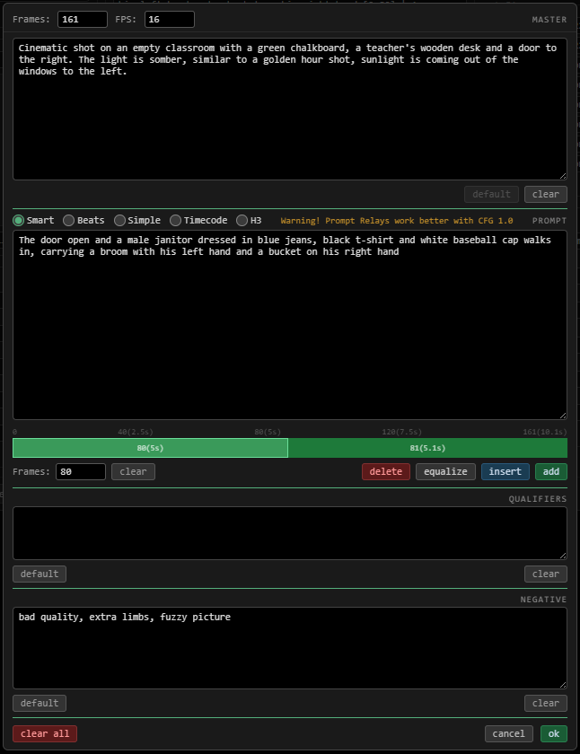
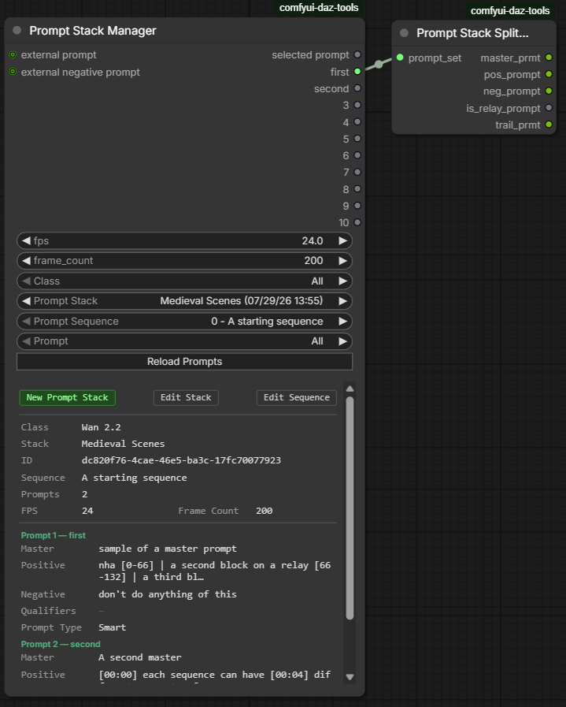
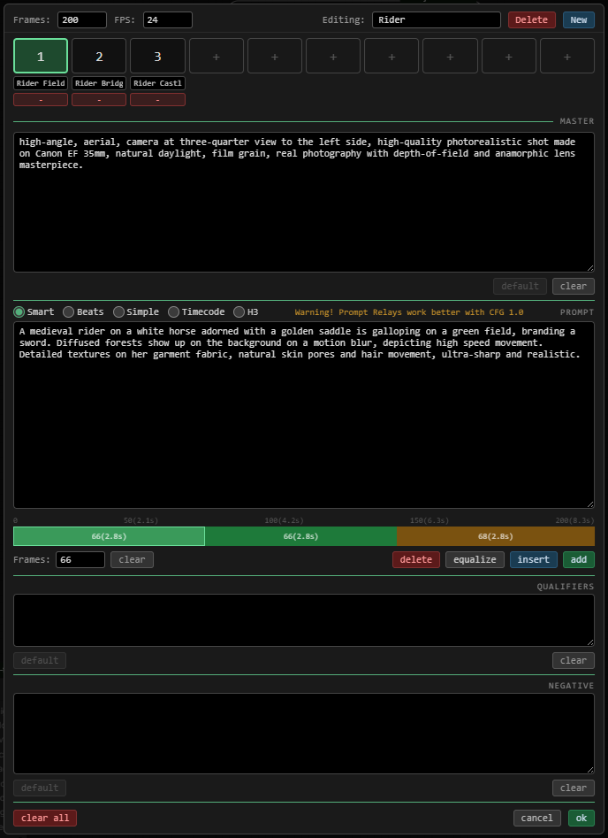
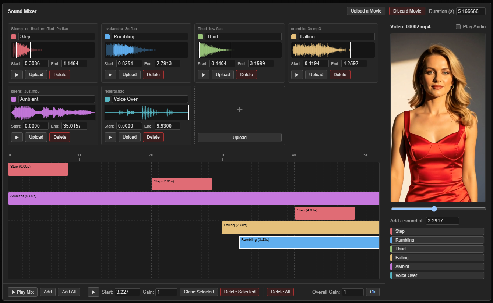

# comfyui-daz-tools

[](https://github.com/denyazzolin/comfyui-daz-tools/releases/latest)

ComfyUI custom nodes by [deny azzolin](https://github.com/denyazzolin).

## Installation

Install from Github...

```bash
cd ComfyUI/custom_nodes
git clone https://github.com/denyazzolin/comfyui-daz-tools
```

...and restart ComfyUI.

You can also install using the ComfyUI Manager. Look for **comfyui-daz-tools**

---

## Nodes

### Workflow Config WAN2.2 (`utils`) · Workflow Config LTX2.3 (`utils`) · Workflow Config LTX2.5 (`utils`) · Workflow Config Image (`utils`) · Workflow Config MiniMaxH3 (`utils`)

These nodes let you store named workflow configurations **"scenes"** — models, prompts, dimensions, LoRAs, and sampling parameters — and switch between them using a dropdown. When you select a scene, the node loads all the models, vae, loras, etc and sends every value downstream automatically for you to wire to your ComfyUI workflows. There is no need to rewire anything when switching between scenes in a given workflow.

The configs are mapped in this way:

- **Movies** are actual json files holding the scene configurations (see more below)
- Each movie file can have multiple **scenes**, they are the main data with all loras, models, prompts, etc
- Each scene can have multiple **takes**, with their own prompts, models, etc. They are effectively "versions" of a given scene. Each scene has at least one take.




#### Movie files

**Movie** files are stored as `dx_*.json` files inside `ComfyUI/user/default/workflows/.dx_mgr/`. A default movie file (`dx_workflow_configs.json`) is created automatically the first time you add a preset through the node UI.

You can have as many movie files as you like — any `dx_*.json` file in that folder is picked up automatically, and a **movie** dropdown appears when more than one file exists. Each file can hold *scenes* for any node class (WAN2.2, LTX2.3, etc.), and each node shows only its own class entries. Use multiple files to organise movies and scenes by project, client, style, or any other grouping.

> **Custom location:** To store movie files somewhere else, create `dx_root_dir_config.json` in the plugin folder (`custom_nodes/comfyui-daz-tools/`) with the key `"workflows_root_dir"` pointing to your preferred path. An annotated example is included as `dx_root_dir_config.example.jsonc`.

#### Movie Manager

Click the **Movie Manager** button on any WorkflowConfig node to open a full-screen popup for managing movie files across all node classes at once — not just the ones matching the node you opened it from.

The popup has two panels:

- **Current Movie** (left) — every `dx_*.json` file found, with name, filename, and scene counts. Buttons let you **Delete**, **Duplicate**, or create a **New Movie** file.
- **Selected Movie** (right) — the chosen file's **Scenes** (any class, not just the current node's) and, nested inside, that scene's **Takes**. Each take also shows its type/group and note. Buttons let you delete a single scene/take or all scenes/all takes at once.

All destructive actions ask for confirmation first, and the popup stays open and refreshes in place after every change so you can keep working without reopening it.

**Load and open in Editor** applies the selected movie/scene/take to the node and opens the edit panel on it — this is how you switch a node to a scene stored in a different movie file. If the selected take belongs to a scene of a different class than the node you opened the Manager from, a warning pops up first (since the node won't be able to load that take's data). Continuing anyway still switches the node to that movie file and shows the node's normal empty state with a **Create** button — letting you create a brand-new scene for the node's class right there, which is handy for reusing an existing movie file across classes instead of creating a new one just to hold a different class's scenes.

**Back** closes the popup without loading anything, reconciling the node's dropdowns to whatever still exists on disk (in case something was deleted while the Manager was open).



#### Filters

Five possible filters at the top of the node let you narrow down which scenes/takes are shown:

- **Movie** - filter among movie files found (only visible if more than one file with scenes for the node's class are found)
- **Type** — filter by workflow type: `All`, `I2V` (image-to-video), `T2V` (text-to-video), or `MULTI`, or none.
- **Group** — filter by a custom group name you assign to presets, or `All` to show everything.
- **Scene** - Selects which scene to load
- **Take** - selects which take of the selected scene to load.

Filters check across all takes of a scene, so a scene that has both an I2V and a T2V version (in the case of videos) appears under both type filters. The take dropdown also updates to show only matching takes.

#### What each node stores

All five nodes share a common set of configurable fields:

| Field | What it controls |
|---|---|
| **Name / Group / Type** | How the preset is identified and filtered |
| **Label** | Optional short label shown in the take dropdown (e.g. `2 - cinematic`) |
| **Note** | Free-form note (up to 900 characters), shown on the node while in use |
| **Image** | Reference input image — a filename inside ComfyUI's input folder, or an absolute path |
| **Audio** | Reference input audio — a filename inside ComfyUI's input folder, or an absolute path. When set, the node outputs the decoded audio on the `audio` output for use downstream |
| **Width / Height** | Output frame dimensions. On the four video nodes these are the *input* to the **Dimensions and More** rule below, which decides what the `width` and `height` outputs actually report |
| **Use media size / Reference media / Scale** | On WAN2.2, LTX2.3, LTX2.5 and MiniMax H3 only — governs the size outputs and which media get resized. See [Dimensions and scaling](#dimensions-and-scaling) |
| **Extended media** | Extra named images, videos and audio the take carries alongside the single Image and Audio slots above. On the four video nodes only — see [Extended media](#extended-media) |
| **Steps** | Number of denoising steps |
| **Seed** | Sampler seed. Enable **Randomize** to pick a new seed automatically on every run |
| **Duration (s)** | Editor-only helper on the WAN2.2, LTX2.3, LTX2.5 and MiniMax H3 nodes: type a length in seconds — or hit one of the **5 / 7 / 10 / 15 / 20** quick buttons (no 20 on MiniMax H3) — and **Total frames** is recalculated for you. The quick button matching the current duration stays highlighted; type anything else and none of them are. Editing Total frames or FPS updates Duration back the other way. FPS must be set first; with FPS at zero the field reports *FPS is not defined* and leaves the frame count alone. How the two convert depends on the node — see [Duration and frame counts](#duration-and-frame-counts) |
| **Total frames / FPS** | Video length and playback speed |
| **Master prompt** | Base text combined with the positive prompt (see Prompts below) |
| **Positive / Negative prompts** | Conditioning text sent to the sampler |
| **LoRA slots** | Up to 8 LoRA slots, each with a model name, strength, and enabled toggle. Disabled or empty slots are skipped automatically |
| **Filename** | Output path, relative to ComfyUI's output folder |
| **Flags 1 / 2 / 3** | Three boolean toggles with configurable labels — useful for routing or switching behaviour downstream |

**WAN2.2** additionally stores:

| Field | What it controls |
|---|---|
| **UNet High** | Diffusion model used for the high-quality pass (supports GGUF — see [GGUF unet loading](#gguf-unet-loading)) |
| **UNet Low** | Diffusion model used for the low/draft pass (supports GGUF — see [GGUF unet loading](#gguf-unet-loading)) |
| **VAE** | Video VAE |
| **CLIP** | Text encoder |
| **Split step** | The step at which the sampler switches from the high to the low model |
| **CFG High / CFG Low** | CFG scale for each model pass |
| **Shift High / Shift Low** | Timestep shift applied to the high and low model passes respectively (default 5.0). Equivalent to ComfyUI's **ModelSamplingSD3** node |

LoRA slots in WAN2.2 are arranged as 4 High/Low pairs, so each LoRA can be applied independently to each model pass. The node outputs a ready-to-use model stack for each pass (`unet_stack_high` and `unet_stack_low`) with all enabled LoRAs applied and the timestep shift already patched in — connect those directly to your sampler. **Shift is applied automatically inside these stacked outputs.** WAN2.2 and MiniMax H3 are the two nodes that patch a shift into their stacked output — the LTX2.3, LTX2.5 and Image nodes have no shift field at all. What the two patch in differs: WAN2.2 sets a timestep shift per model pass, MiniMax H3 a video/audio flow shift pair on its single model.

**LTX2.3** additionally stores:

| Field | What it controls |
|---|---|
| **Checkpoint** | A combined model file that includes the diffusion model, CLIP, and VAE in one |
| **UNet / Transformer** | Standalone diffusion model, used when not loading from a checkpoint (supports GGUF — see [GGUF unet loading](#gguf-unet-loading)) |
| **Video VAE / Audio VAE** | Separate VAE models for video and audio |
| **CLIP / CLIP 2** | Primary and secondary text encoders |
| **Latent Upscaler** | Latent upscale model from `models/latent_upscale_models`, loaded through ComfyUI's **Load Latent Upscale Model** node and exposed on the `latent_upscaler` output. Optional — leave it on *none* and the output is empty |
| **CFG** | CFG scale |

You can fill in either the checkpoint path or the standalone model paths — both sets of outputs are available on the node. The node outputs a ready-to-use model stack with all enabled LoRAs already applied for both the standalone transformer and the checkpoint model.

**Workflow Config LTX2.5** targets LTX v2.5. It drops the checkpoint loader and the second CLIP slot that LTX2.3 needs — LTX2.5 ships a single text encoder file (`gemma4-12b-with-proj-…`) that already contains the text-embedding projection weights LTX2.3 keeps in a separate file. Otherwise it matches LTX2.3: video/audio dual-VAE split, reference image and audio inputs, single CFG, and 8 LoRA slots.

| Field | What it controls |
|---|---|
| **Transformer** | Diffusion model (supports GGUF — see [GGUF unet loading](#gguf-unet-loading)) |
| **Video VAE / Audio VAE** | Separate VAE models for video and audio, both loaded from `models/vae` |
| **CLIP** | Single text encoder (loaded with the LTXV CLIP type) |
| **Latent Upscaler** | Latent upscale model from `models/latent_upscale_models`, loaded through ComfyUI's **Load Latent Upscale Model** node and exposed on the `latent_upscaler` output. Optional — leave it on *none* and the output is empty |
| **CFG** | CFG scale |

The node outputs a ready-to-use model stack (`transformer_stack`) with all enabled LoRAs already applied.

**Workflow Config Image** is designed for still-image pipelines. It has no LoRA slots, no audio field, and no video parameters (frames / FPS). The Type filter is also not shown — all scenes/takes are listed regardless of type.

| Field | What it controls |
|---|---|
| **Checkpoint** | A combined model file that includes the diffusion model, CLIP, and VAE in one |
| **Diffuser** | Standalone diffusion model, used when not loading from a checkpoint (supports GGUF — see [GGUF unet loading](#gguf-unet-loading)) |
| **VAE** | Standalone VAE |
| **CLIP** | Standalone text encoder |
| **CLIP Type** | The encoder family used when loading the standalone CLIP — one of `stable_diffusion`, `flux`, `sd3`, `wan`, `hidream`, `chroma`, and many others |
| **CFG** | CFG scale |
| **Custom param 1 / 2** | Two free-form string outputs (`custom_1`, `custom_2`), each with a configurable label. Useful for passing arbitrary values downstream (e.g. style names, scheduler identifiers, preprocessor flags) |

You can fill in either the checkpoint path or the standalone model paths — all outputs are available on the node regardless of which set is populated.

**Workflow Config MiniMaxH3** targets the MiniMax H3 model. Unlike WAN2.2, it has a single UNet/CFG (no High/Low pass split) but keeps the video/audio dual-VAE split, reference image and audio inputs, and 8 LoRA slots.

| Field | What it controls |
|---|---|
| **Unet** | Diffusion model (supports GGUF — see [GGUF unet loading](#gguf-unet-loading)) |
| **Video VAE / Audio VAE** | Separate VAE models for video and audio |
| **CLIP** | Text encoder (loaded with the MiniMax CLIP type) |
| **CFG** | CFG scale |
| **Shift Video / Shift Audio** | Flow shifts patched into `unet_stack` — the pair ComfyUI's **ModelSamplingMiniMaxH3** node takes as `shift_video` and `shift_audio` (12.0 and 3.0 there). Stored as `shift_high` / `shift_low`. The model derives the two together, so they are set together or not at all: leave both at 0 and the model comes out unpatched, which is what a take that has never touched them does. Set just one and neither is applied, with a note in the console |


#### GGUF unet loading

The standalone unet field on each node (**UNet High/Low** on WAN2.2, **UNet/Transformer** on LTX2.3, **Transformer** on LTX2.5, **Diffuser** on Image, **Unet** on MiniMaxH3) can point at a GGUF-quantized model instead of a regular `.safetensors` file. The model dropdown lists regular and `.gguf` files together; picking a `.gguf` entry automatically checks the read-only **gguf** checkbox shown above the dropdown, and the node loads it through ComfyUI-GGUF's unet loader instead of the standard diffusion model loader — no other configuration needed.

Requires the [ComfyUI-GGUF](https://github.com/city96/ComfyUI-GGUF) custom node package. Without it installed, `.gguf` files won't be listed, and running a scene configured for GGUF raises a clear error instead of silently falling back.

LoRAs and the shift model patch (WAN2.2 and MiniMax H3) are fully supported on GGUF-loaded unets, same as regular models.

Presets carry the `gguf` flag along with the model name, so applying a preset with a GGUF model correctly sets the loader to use.

**How to start?**: hit the **New Scene** button, which will bring up the editor for you to start creating your scene/take! (if there's presets in place, the editor will ask you to pick one or go anew).

As you create scenes and takes, you may easily just **duplicate** one to keep working on a separate scene or to bootstrap the creation of a new scene.

Below is a picture of the scene editor.



#### Versioned takes

In order to expedite the experimentation with scenes, you can create as many **takes** as you want. Each named scene can hold multiple takes — independent snapshots of the scene's settings, numbered from 1 and with an optional label. The takes cover all of a scene's settings (like model paths, vae paths, resolution, steps, prompts, loras, etc). So you can vary everything, experiment with new prompts, add other reference images, other loras, etc, all in the context of the same scene.

Each take can have an optional short **label** shown in the dropdown (e.g. `2 - cinematic`). To create a new take, just change whatever you want and hit the "Save as New Take" button — or hit **New/Duplicate Take** on the node, which opens the editor on the current take and saves it as a new take in the same scene.

#### Dimensions and scaling

The four video nodes (WAN2.2, LTX2.3, LTX2.5, MiniMaxH3) size their `width` / `height` outputs and resize media together, from **Use media size**, **Reference media** and the **Scale** box in the editor's *Dimensions and More* panel. The Image node has none of them — its Width and Height are what you type. Resizing always uses **lanczos**.

Two separate choices are involved:

- **Reference media** picks the one image or video the rule *measures* — any filled slot in the *Reference Image and Audio* box, listed as *type - label / file (w x h)*.
- **Resize**, in the corner of each image and video preview, marks the slots the rule *applies to*. Any number of them, each scaled against its own size — so a factor of 0.5 halves every marked slot, whatever size each one started at. An unmarked slot is handed to the node untouched. A marked slot shows the size it will come out at in yellow, under its own size, as soon as the rule has a size to give it.

**Use media size off** — the Width and Height you typed are the input to the scale mode:

| Scale mode | Width / height outputs | Each marked slot |
|---|---|---|
| **None** | As typed | Untouched |
| **Factor** | Both multiplied by **Scale by** | Multiplied by the same factor, on its own aspect ratio |
| **Longest dimension** | Follow the reference media's new size, or scale the typed size if there is no reference | Its longest side becomes the value, aspect ratio kept |
| **Fit** | As typed | Scaled to cover the box and cropped at the centre; media smaller on *both* axes is stretched instead, so nothing needs padding |

Every size in that table that the rule *calculates* — the **Factor** and **Longest dimension** rows, both the outputs and the marked slots — is then rounded **down** to a multiple of the divisor picked beside the **sizing** button. **None** and **Fit** calculate nothing: their sizes are the ones you typed, and those are used exactly as typed. Each axis is rounded on its own, so a snapped size can sit slightly off the aspect ratio it came from, and nothing is ever rounded below one whole step.

**Use media size on** — the outputs are the reference media's own size and the typed values are ignored. Only **None** and **Factor** are offered, and a factor scales the outputs and the marked slots together. Unavailable until a reference is picked.

Whenever the size comes from the reference the editor fills the boxes in and shows them read-only; what you typed comes back when it stops. The stored Width and Height are never rewritten by a run.

#### Extended media

Beyond the single **Image** and **Audio** slots, a take can carry named extra media for workflows that need more than one reference — REF2VA on MiniMax H3, MSR on LTX2.3 and LTX2.5, first-frame/last-frame and multi-frame setups anywhere. The four video nodes carry the whole lot on one `extended_media` output; the **Image** node has none.

A take has **5 image slots**, **2 video slots** and **2 audio slots**. Image slot 1 and audio slot 1 are the take's own **Image** and **Audio**; the rest are the extra ones. Those numbers are the ones the editor shows and the ones the Media Splitter's sockets carry — image slot 3 is always `image_3`, whatever else is filled.

A slot is a fixed position rather than a place in a list: filling or clearing one never shifts another, gaps are fine, and an empty slot simply outputs nothing. Each slot also carries a **name** of your own, written in the box beside its **clear** button — a label for you, which never renames a socket.

A video slot loads a window of the clip, not the whole thing — the two handles under its preview pick which stretch, and a slot left alone loads the clip whole.

Decoded frames are float32 RGB — about 12 bytes a pixel — so a decode also stops at **600 frames** or **4 GB**, whichever comes first, and says in the console which ceiling it hit.

**Resize**, the checkbox in the corner of an image or video preview, marks that slot for the take's scale rule — see [Dimensions and scaling](#dimensions-and-scaling). Any number of slots may be marked, the take's own reference image included.

**Reference media**, in the **Dimensions and More** box, names the one slot the rule *measures*. It lists every filled image and video slot, and the pick is on the slot: re-picking a file there keeps the rule measuring it, and clearing the slot clears the pick.

##### Audio from a video

Either audio slot can take its sound off a loaded video instead of holding a file of its own: its picker lists the take's loaded videos above the input folder's audio files, and picking one sounds that clip's track. It arrives trimmed to the stretch the video's handles chose, so what is heard is what that video slot decodes. A file and a video are never both set — the picker is one dropdown.

The pick is on the *slot*, not the file: re-picking a video keeps it, and the sound follows whatever is loaded there. Clearing that video slot ends it and returns the audio to **— no audio —**, as does a new clip with no track of its own. A silent video is never offered in the first place, and nothing is ever extracted to a file: the play button reads the track out of the streamed clip, and a run decodes just the window it needs.

The **Reference Image and Audio** box in the editor is where all of it is set. Three tabs — **Images**, **Audio**, **Video** — switch what the box is showing, always opening on Images. Images and Video each show a row of numbered slot buttons above one picker and one preview: the button picks the slot, the picker and the **Upload…** and **clear** buttons act on whichever slot is showing, and **Resize** in the corner of the preview marks that slot for the take's scale rule. A slot button's number is grey while that slot is empty, so the row says what is filled without clicking through it. Each preview reports the size of what is in it in the top corner — and, under that in yellow, the size the take's scale rule will resize it to, whenever the slot is marked **Resize** and the rule has a size to give it. Each also carries a **name** box beside **clear**. A video preview plays and pauses when clicked and loops when it reaches the end, and reads the rate, frame count and frame size off the file itself — all three belong to the clip, so none is stored in the take. Under it, two handles pick the stretch the take uses: dragging one stops playback and shows the frame under it, and the preview then plays that stretch alone. Picking, uploading or clearing a file hands them back the whole clip. Only the slot on screen streams, so the preview buffers the whole clip ahead of the playhead without a second slot competing for it. Audio has no preview or slots to switch: both lines are shown together, each framed with its own number, picker, upload, clear, name and a play button that toggles to stop while it is sounding. Each picker lists any loaded video that has a track of its own directly under **— no audio —**, above the input folder's audio files.

#### Duration and frame counts

**Duration (s)** is never stored — only **Total frames** and **FPS** are, and the duration is parsed back from them every time the editor opens. Each node converts the two its own way:

| Node | Duration → Total frames |
|---|---|
| **WAN2.2, LTX2.3, LTX2.5** | `duration × fps + 1`, counting the first frame |
| **MiniMax H3** | padded up to the next count where `(frames - 5) ÷ 17` is whole, the grid the model renders best on — at 24 fps that is 5s → 124, 7s → 175, 10s → 243, 15s → 362 |

You can always type a frame count of your own; the duration follows it. Parsing back aims to reproduce the duration originally entered rather than to divide, so a clip asked for as 5s reads as 5s and not as the fraction its frame count divides into. Rounding shows up at values the formula would not have produced — a hand-typed frame count, a fractional duration, or MiniMax below 17 fps — where the duration reported may differ slightly from what was entered.

#### The Sizing dialog

The **sizing** button beside Width and Height opens a picker of known-good resolutions: choose an aspect ratio (1:1, 16:9, 9:16, 3:2, 2:3, 4:3, 3:4), choose what the result must divide by (8, 16, 32, 64), and take one of the five sizes offered. **OK** writes the pair into Width and Height, **Cancel** discards — nothing else closes the dialog. It opens on the current size if that size is in the list, otherwise on 9:16 ÷32, and is disabled while the size is being derived from the image.

The **8 / 16 / 32 / 64** buttons beside it are the divisor the scale rule rounds its calculated sizes down to — see *Dimensions and scaling* above. They are toggles: clicking the lit one turns the divisor off, which is the only way to reach 0, so there is no button for it. New takes start on **32**. The Image node has no scale rule and so has no buttons.

A yellow **! not /X** flags a Width or Height that is not a multiple of the divisor, and says nothing while the divisor is off. Advisory only — it fires on sizes the rule does not round, which is exactly the ones you typed yourself.



#### Managing prompts

Each scene/take stores three prompt fields — **Master**, **Positive**, and **Negative** — along with a **Prompt Type** that controls how the positive prompt is structured, plus an optional **Qualifiers** (trail) prompt that's appended to the end of the positive prompt after a blank line when the workflow runs. Master and Qualifiers each have a **Default** button (fills in a class-specific default template, when one is defined for the node's class/type) next to their **Clear** button.

| Type | How it works |
|---|---|
| **Smart** | The positive prompt is split into pipe-separated segments, each covering a frame range (`text [start-end] \| text [start-end] \| …`). A downstream Prompt Relay node handles distribution across frames. Best used with CFG ≈ 1.0. |
| **Beats** | Segments are aligned to time ranges in seconds (`[start-ends] text`, one per line). Frame counts are derived from FPS automatically. |
| **Timecode** | Segments are aligned to absolute start times (`[MM:SS] text`, one per line). Each marker is the segment's start time; frame counts are derived from the gap to the next marker (or the end of the video) using FPS. |
| **H3** | One segment per line. The first segment opens with `[Shot 1]` and carries no time; every later one starts with its start time, `At MM:SS.mmm, text` (two-digit minutes and seconds, three-digit milliseconds). Tick **is Shot** on a segment in the editor and it also gets a `[Shot N]` in front of its time — shots are numbered in order on save. Each segment's text gets a trailing period if it doesn't already have one. Frame counts are derived the same way as Timecode; a `[Shot N]` with no time after it splits the frames evenly. Parsing back starts a segment at every `[Shot N]`, wherever it sits in the line, and at every line that starts with a time mark. The comma after the time is required, and the old `At X.Ys,` marks are still read, so saving rewrites them in the new format. When the prompt has section labels, only a `[Shot N]` under `integrated_multimodal_description:` or `detailed_description:` starts a segment — those under `subject_definitions:`, `summary:` and the like stay as text. A prompt saved as another type is never read as H3. |
| **Simple** | A single flat text string passed as-is. |

For **Simple**, **Beats**, **Timecode**, and **H3** types, the Master prompt is combined with the positive prompt before it reaches the sampler. An **Append** checkbox lets you switch the Master to go after the positive text instead of before (the default). For **Smart**, the positive text goes to the relay as-is, and the Master is available as a separate output.

**Prompt Editor**



Click **Prompt Editor** inside the edit panel to open a full-screen editor. It loads the current Master, Positive, Negative, Qualifiers, total frames, and FPS values and lets you work with them visually.

- **Frames / FPS** — changing Frames rescales all segment lengths proportionally; changing FPS updates the time labels on the ruler.
- **Master** — free-form text area. A **Default** button (left of **Clear**) fills in a class-specific default template, when one is defined for the node's class — currently only MiniMax H3, whose default varies by I2V/T2V/MULTI workflow type. For Beats, Timecode, H3, and Simple, an **Append** checkbox next to it sets whether the Master goes before or after the positive prompt.
- **Prompt type** — switch between Smart, Beats, Timecode, H3, and Simple. Switching converts existing segments where possible (e.g. Beats → Simple merges all segment texts into one block). Switching to H3 from another type also takes a pasted full prompt apart: the text before the `[Shot 1]` that opens the first segment is added to the end of the Master, and the last segment's text from `overall_soundscape:` or `non_diegetic_music:` onward is added to the front of the Qualifiers — so a full prompt pasted as Simple is split up just by selecting H3.
- **Segment bar** — a horizontal bar showing each segment as a proportional colour-coded block. Click any block to select it; the active segment is highlighted in green.
- **Frame ruler** — marks 0%, 25%, 50%, 75%, and 100% of total frames. When FPS is set, labels include both frame number and seconds (e.g. `40 (2.5s)`).
- **Segment text** — edit the text for the selected segment.
- **Segment controls** — set the exact frame count, clear the text, delete the segment, or equalize all segments evenly. **Insert** adds a new segment right before the selected one; **Add** appends one at the end. Both fill any remaining space first; once the timeline is full, they instead carve out a one-second segment (based on FPS) and proportionally rescale every other segment to preserve its relative timing (minimum 1 frame each).
- **Qualifiers** — free-form text area for the trail prompt, with its own **Default** button (same class-specific-template mechanism as Master) aligned to the left, like Negative's. When re-opening a saved prompt, text at the end of the last segment that matches the saved Qualifiers text (after a newline) is stripped back out so it isn't shown duplicated inside the segment.
- **Negative** — free-form text area with a **Default** button that fills in a class-specific default negative prompt, when one is defined.
- **Clear All** — resets Master, Positive, Negative, and Qualifiers to empty and collapses to a single segment.

Clicking **OK** sends all values back to the edit panel. It does **not** save to disk — use **Save** or **+ Take** in the edit panel to persist.

#### Edit mode

Open the full-screen edit panel by clicking the node's **Edit Take** button (or double-clicking the node on the canvas).

The panel has three columns:
- **Left:** Name, Group, Type, Note, reference image and audio, dimensions, seed, CFG, frames, and FPS.
- **Center:** Prompt Type selector, Master / Positive / Qualifiers / Negative prompts, and the **Prompt Editor** button.
- **Right:** Model selectors, LoRA slots (name, strength, enabled toggle), filename, and flag labels.

| Button | What it does |
|---|---|
| **Save** | Overwrites the current take with the panel values |
| **+ Take** | Saves the current panel as a new auto-numbered take |
| **Duplicate** | Copies this preset — you can duplicate all takes, just the current take, or add a new take to the same preset. If there are unsaved changes, prompts to save or discard first |
| **Delete Take** | Removes the current take (removes the entire scene if it is the last take) |
| **Del All** | Deletes the entire preset and all its versions |
| **Cancel** | Returns to use mode; prompts to discard if there are unsaved changes |

**Name conflicts** — if saving or duplicating would clash with an existing preset name, a popup offers to cancel or auto-rename (appends `_alt` + 4 random digits).

**Rename warning** — saving with a changed name applies to all versions in the preset; a confirmation popup appears before proceeding.

**Use mode** — when not in edit mode, the node shows a summary of the active take, including its movie (when more than one file is loaded), group, type, scene, take, and note. LoRA enabled toggles and flag toggles can be changed directly from use mode without opening the edit panel, and save immediately.

When no presets exist yet, the node shows an empty state with a centred **Create** button.

#### Preset library

The preset library is a shared collection of model-and-parameter templates (`dx_workflow_presets.json` inside `.dx_mgr/`). Presets are not tied to any single workflow — they capture a node's key settings (models, dimensions, CFG, type, etc.) and can be applied to any config of the same class. This makes spinning up a new scene significantly faster: instead of filling in every field from scratch, you pick a preset and the edit panel is pre-filled in one click.

For WAN2.2, LTX2.3, LTX2.5, and MiniMax H3, presets also carry the full LoRA setup — all 8 slots, including empty/disabled ones. Applying a preset overwrites all of the current config's LoRA slots, so the pre-filled panel always reflects exactly the preset's LoRA setup rather than a merge with whatever was there before.

Presets also carry the 3 flag toggles and 2 custom params, labels included, for all node classes. Presets carry the Qualifiers (trail) prompt alongside Master/Positive/Negative for every node class.

For WAN2.2, LTX2.3, LTX2.5, and MiniMax H3, presets carry **Total frames** and **FPS** as well — applying one re-derives the editor's **Duration (s)** from them. Those four also carry the **Use media size**, **Scale** and divisor settings (see [Dimensions and scaling](#dimensions-and-scaling)) — but not **Reference media**, which names one of the take's own slots and so stays as the take had it; applying one re-checks the rest against the config being edited, so a preset saved with **Use media size** on lands with it off if the config has no reference picked. LTX2.3 and LTX2.5 presets additionally carry the **Latent upscale** model. The Image node has no frame count, FPS, or reference image, so its presets carry none of these.

Presets saved before these fields existed simply do not include them, and applying such a preset leaves the corresponding fields in the panel untouched rather than zeroing them.

Three buttons in the edit panel footer give access to the library:

**Apply Preset** — opens a browser showing all saved presets for this node class (every class except Image includes a type filter). Select a preset and click **Apply** to write its values into the current edit panel. When you create a new config and presets already exist for that class, this browser opens automatically.

**Save / Update Preset** — opens the same browser with three actions:
- **Update the Version** — overwrites the selected preset version with the current config's values.
- **Save as new Version** — saves the current config as an additional numbered version under the same preset name.
- **Save as New Preset** — opens a form to name the new preset, choose its type (every class except Image), add an optional version label and note. All model and parameter values are captured from the current config automatically. Saving is blocked if a preset with the same name already exists at version 1 for this class.

**Manage Presets** — opens the browser in delete mode. You can remove a single version or the entire preset and all its versions.

---

### Prompt Stack Manager (`utils`) · Prompt Stack Splitter (`utils`)

A **prompt stack** is a library that can hold an arbitrary collection of named **prompt sequences**. A sequence is up to 10 ordered slots, each slot a full prompt made of a **Master prompt**, a **Positive prompt** (typed as **Smart** (relay), **Beats**, **Timecode**, **H3**, or **Simple** — see [Managing prompts](#managing-prompts) for what each type means), a **Negative prompt**, and an optional **Qualifiers** (trail) prompt appended to the end of the positive prompt after a blank line.

This sequencing is particularly useful for video workflows made up of several sequential parts with their own prompts — e.g. WAN2.2 SVI 2.0 flows — where each part of the video needs its own prompt fed to a downstream sampler/relay in order.



- **Prompt Stack Manager** stores and edits named prompt stacks, each holding one or more sequences (versions of the stack). It outputs each slot's prompt as a single bundled `DX_PROMPT_SET` value on `prompt_seq_1`…`prompt_seq_10`; slots beyond the sequence's prompt count output nothing (`None`). A first output, `selected_prompt`, carries whichever prompt is picked by the **Prompt** dropdown (or the sequence's first prompt when it's set to **All**) — handy for wiring a single slot without picking through `prompt_seq_1`…`prompt_seq_10`.
- **Prompt Stack Splitter** takes one `DX_PROMPT_SET` input and unpacks it into `master_prmt`, `pos_prompt`, `neg_prompt`, `is_relay_prompt`, and `trail_prmt` (STRING/STRING/STRING/BOOLEAN/STRING), using the same master+positive combination rule as the WorkflowConfig nodes' prompt handling. `pos_prompt` already has the Qualifiers (trail) prompt merged onto its end; `trail_prmt` externalizes that same text on its own for wiring separately. Feed it `None` (an unused slot) and it outputs `("", "", "", False, "")`.

Stacks are stored in a single file, `dx_prompt_stacks.json` inside `.dx_mgr/`, alongside the movie files. Unlike WorkflowConfig, there's no per-class node or movie-file switching — one node handles every class, and a stack's **Class** (`Wan 2.2`, `LTX 2.3`, `LTX 2.5`, `Images`, `Krea2`, `Flux2 Klein 9B`, `Qwen Image`, `Chroma`, `Z-Image Turbo`, `FLux 2`, `Wan Image`, `MiniMax H3`, or none) is just an informational tag you can filter by.

#### Prompt Stack Manager panel

The node has **Class** (filters the Prompt Stack dropdown), **Prompt Stack**, **Prompt Sequence**, and **Prompt** dropdowns, plus **FPS** and **Frame Count** fields (stored per-stack, changing them saves immediately). The panel also shows the stack's **ID** — a unique string (GUID) assigned automatically when the stack is created, stable across renames, reserved for future referral/integration use. **Prompt** lists every slot in the active sequence and defaults to **All**; picking a single slot narrows the read-only panel below to just that prompt (and drives the `selected_prompt` output) — Master, Positive, Negative, Qualifiers, and Prompt Type for each.

Wiring an upstream STRING into the optional **external_prompt** input adds an **External Prompt** entry to the **Prompt** dropdown; selecting it makes `selected_prompt` carry the wired text as a Simple positive prompt instead of any stored slot, without saving anything to the stack file (`prompt_seq_1`…`prompt_seq_10` are unaffected). An optional **external_negative_prompt** input supplies that prompt's negative text — it's not required and defaults to empty if unwired. Selecting External Prompt with `external_prompt` disconnected or empty raises an error at runtime.

Three buttons above the panel:

| Button | What it does |
|---|---|
| **New Prompt Stack** | Opens a small form for a name and class, creates the stack with one empty sequence, and switches the node to it |
| **Edit Stack** | Opens a popup to rename the stack, change its class, **Duplicate** or **Delete** it, and manage its sequences — **New**, **Duplicate**, **Delete**, or **Edit Sequence** (which opens the prompt editor below) |
| **Edit Sequence** | Jumps straight into the prompt editor for the currently active sequence |

The **prompt editor for stacks** is the same full-screen editor used by the WorkflowConfig nodes' **Prompt Editor**, opened here in a mode that edits a whole sequence's list of prompts at once (add/remove/reorder prompts, each with its own label, Master/Positive/Negative text, and Prompt Type — Smart/Beats/Timecode/Simple, same rules as described under [Managing prompts](#managing-prompts)). Saving there writes the sequence back to the stack file and closes both the editor and the Edit Stack popup. A stack is capped at 10 sequences, and each sequence at 10 prompts, matching the node's fixed 10 outputs.



---

### Media Splitter (`utils`)

Unpacks the `extended_media` output of a WorkflowConfig node into one output per slot: `image_1`…`image_5` and `video_1`…`video_2` (IMAGE — a video slot is an image batch of its decoded frames), and `audio_1`…`audio_2` (AUDIO). Slots the take left empty output nothing (`None`).

The numbering is the editor's, so `image_1` and `audio_1` are the take's own reference image and audio — the same ones the WorkflowConfig node puts on its **image** and **audio** outputs, ridden along here so a workflow can take every slot off this node instead of reaching back for the first of each. They are handed on, not loaded again, so wiring both costs nothing. A take with no reference image or audio leaves those outputs empty like any other unfilled slot.

The outputs are fixed and slot-numbered, so `image_3` is always the take's image slot 3 regardless of what the other slots hold. See [Extended media](#extended-media) for what goes into the slots.

---

### Sound Mixer (`audio`)

Mixes multiple audio files into one `AUDIO` output. Click **Edit Mix** to open the mix editor.

In general, the editor lets you: set the overall mix **duration**; add up to 16 **sources** (uploaded audio files), each with its own **trim** (start/end crop) and **fade in/out**, both dragged as sliders over the waveform — a **Fade** checkbox switches which pair the sliders set; **place** a source on the timeline any number of times, freely repositioning each placement with a slider and adjusting its own **gain**; **play** the whole mix, a single source, or one placement at any point while editing, stopping it again with the same button; and optionally **load a video**, scrub through its exact frames, and add sources at a time picked straight from the video — with the video and audio mix **playable together in real time**.

The video is remembered with the workflow, so it's still loaded next time you open the editor. An **FPS** box beside Duration re-rates it: the movie plays back as if it ran at that frame rate, and every placement moves with the frame it was set against — a sound on frame 32 of a 32 fps movie sits at 1s and moves to 2s once the movie is called 16 fps. The value shows red while it differs from the file's own rate, and **Esc** in the box restores it. Whenever the movie's length and the mix duration disagree, the editor offers to match them.

A mix can be kept outside the workflow. **Save Mix** (bottom bar) asks for a **Folder** and a **Name** and writes `<name>.json` under `.dx_mgr/sound_mixes/`, alongside the movie files; the folder is optional and just for your own grouping. **Load / Manage Mix** (top bar) lists every saved mix as `folder\name`, 12 at a time, and loading one replaces whatever is currently set up — it asks first if there's anything to lose. Every row there has a checkbox, and the red **Delete** below the list — greyed out until something is ticked — removes the ticked mixes from disk after a confirmation, then re-reads the list; a folder left with no mixes in it goes with them. Saving over an existing file asks before replacing it, and a file that isn't a valid mix is reported rather than half-loaded.

The file holds everything needed to rebuild the mix: duration and sample rate, overall gain, every source with its trim and fades, every placement with its gain, and the movie with its FPS override. The audio and video files themselves aren't copied — only their names, resolved against ComfyUI's `input/` directory. Once a mix has been saved or loaded, the editor's title reads `Sound Mixer - folder\name` and **Save Mix** reopens on that folder and name. Delete that file and the title goes back to plain **Sound Mixer**, while the mix itself stays open and unchanged.



---

### Check Null (`utils`)
- **Input:** any value (optional)
- **Output:** `is_null` (BOOLEAN) — `True` if the value is null, None, NaN, or empty string

---

### Null Audio Checker (`audio`)
Checks if the audio output from [ComfyUI-VideoHelperSuite](https://github.com/Kosinkadink/ComfyUI-VideoHelperSuite) is null (video had no audio track).
- **Input:** `audio` (AUDIO)
- **Output:** `is_empty` (BOOLEAN)

---

### Abs Int (`math`)
- **Input:** `value` (INT)
- **Output:** `abs_value` (INT)

---

### Lora Inspector (`utils`)
Scans `models/loras`, reads safetensors metadata, and caches results to `models/loras/dx_lora_db.json`.

- **Inputs:** `lora` (dropdown, prefixed by category) · `rescan` (BOOLEAN)
- **Output:** `lora_data` (STRING) — JSON with three sections:
  - `general`: `filename`, `path`, `category`, `base_model_version`, `network_dim`, `network_alpha`, `potential_triggerwords`, `file_size_mb`, `last_modified`
  - `extended`: `network_module`, `network_args`, `steps`, `num_epochs`, `epoch`, `resolution`, `num_train_images`, `training_comment`
  - `training`: `optimizer`, `learning_rate`, `unet_lr`, `text_encoder_lr`, `lr_scheduler`, `noise_offset`, `min_snr_gamma`, `mixed_precision`

**Categories** (inferred from `ss_base_model_version`):

| Category | Matches |
|---|---|
| `WAN2.2` | Wan 2.2 |
| `WAN2.1` | Wan 2.1 |
| `LTX2.3` | LTX v2.3 |
| `LTX2` | LTX v2.x |
| `LTX` | LTX (any other) |
| `Flux1` | Flux.1 |
| `Flux2` | Flux 2 |
| `Flux2 Klein` | Flux Klein |
| `Chroma` | Chroma |
| `ZIT` | Z-Image |
| `Qwen` | Qwen |
| `Others` | Anything else or missing metadata |

**First-time setup:** entries show as `Unknown` until you tick **Rescan = Yes**, run the node once, then reload the page.
